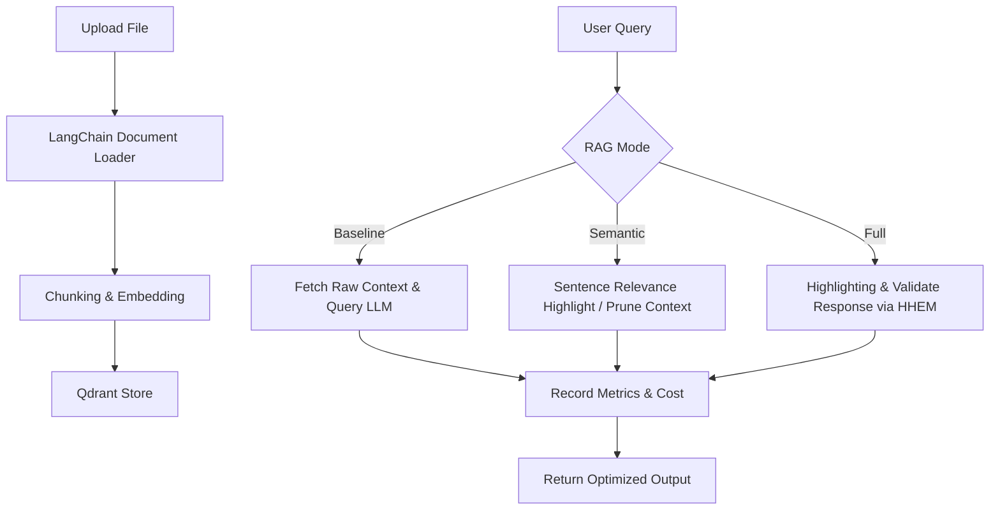

# 🌌 HighHEM

> **An ultra-efficient, production-ready FastAPI implementation demonstrating massive cost savings & quality guardrails in RAG pipelines using Semantic Highlighting, Vectara HHEM, and unified model routing via MeshAPI.**

---

<p align="center">
  <a href="https://meshapi.ai"></a>
  <a href="https://fastapi.tiangolo.com"></a>
  <a href="https://qdrant.tech"></a>
  <a href="https://python.org"></a>
</p>

> [!IMPORTANT]
> **🚀 Featured Integration: Unified Routing with MeshAPI**
> HighHEM features native, out-of-the-box integration with **[MeshAPI](https://meshapi.ai)**! 
> 
> **MeshAPI** provides a robust, unified, OpenAI-compatible API to route query and embedding requests to various frontier LLMs (e.g. GPT-4o, Claude 3.5 Sonnet, Llama 3) under a single key. By combining MeshAPI's cost-effective model routing with HighHEM's **Semantic Highlighting**, you can achieve up to **70% cost savings** on RAG workloads!

---

## 🎯 Core Optimization Strategies

HighHEM solves the two biggest challenges in production RAG systems: **skyrocketing token costs** and **hallucinations**.

### 1. 🔍 Semantic Highlighting (Context Pruning)
Standard RAG feeds entire chunks to the LLM, passing irrelevant text and noise, which inflates token counts and degrades generation quality. HighHEM's Semantic Highlighting tokenizes chunks at the sentence level, scores each sentence against the query using a bi-encoder transformer, and filters out sentences below your threshold.
* **Impact:** 30–70% input token reduction with zero loss in generation context quality.

### 2. 🛡️ HHEM Validation (Hallucination Guard)
To ensure safety and correctness, HighHEM validates LLM responses in real-time using Vectara's Hughes Hallucination Evaluation Model (HHEM). If the response score falls below the target threshold, the system flags the potential hallucination.
* **Impact:** Active protection against incorrect, generated claims.

### 3. 🌐 MeshAPI Integration (Vendor Lock-in Immunity)
Seamlessly route API requests to any model provider (e.g. custom or next-gen models like `openai/gpt-5.4`) using MeshAPI's unified schema. Features built-in tokenizer resilience so unrecognized custom/experimental model names automatically fall back to standard `cl100k_base` encoding rather than raising errors.

---

## ✨ Key Features & Capabilities

- 📂 **Flexible Document Ingestion:** Built-in loaders for PDF, Markdown, Text, and JSON.
- ✂️ **Semantic Pruning:** Sentence-level relevance scoring & filtering.
- 🚦 **Faithfulness Scoring:** Live HHEM validation of generated answers.
- 📊 **A/B Performance Comparison:** Compare `/compare` endpoints to inspect token consumption, cost, and latency side-by-side (Baseline vs Semantic vs Full).
- 🌐 **Unified API Routing:** Complete compatibility with **MeshAPI**, DeepSeek, Groq, Ollama, and OpenRouter.
- 🧠 **Resilient Token Estimation:** Custom fallback wrapper prevents tokenizer crashes on experimental or custom LLM names.

---

## 📁 Project Structure

```text
highhem/
├── app/
│   ├── __init__.py
│   ├── main.py                 # FastAPI application & endpoints
│   ├── models.py               # Pydantic data schemas
│   ├── config.py               # Settings & environment configuration
│   ├── services/
│   │   ├── __init__.py
│   │   ├── document_processor.py  # Text extraction & parsing
│   │   ├── vector_store.py        # Qdrant read/write operations
│   │   ├── semantic_highlighter.py # Sentence relevance highlighting
│   │   ├── hhem_validator.py      # Vectara HHEM hallucination scoring
│   │   └── rag_engine.py          # Orchestrator coordinating flow
│   └── utils/
│       ├── __init__.py
│       └── metrics.py             # Metrics tracking & saving analysis
├── data/                       # Local Qdrant database persistence
├── notebooks/
│   └── rag_showcase.ipynb      # Interactive step-by-step tutorial notebook
├── uploads/                    # Directory for temporary file uploads
├── pyproject.toml              # Project dependencies and packaging settings
├── uv.lock                     # Lock file for Python dependencies
├── .env.example                # Sample environment file
├── docker-compose.yml          # Container configuration (Qdrant, etc.)
└── README.md                   # This documentation
```

---

## 🚀 Quick Start

### 1. Clone & Set Up Environment

```bash
# Clone the repository
git clone https://github.com/your-username/highhem.git
cd highhem

# Create virtual environment (Python 3.12) & install dependencies
uv venv --python 3.12
source .venv/bin/activate  # On Windows: .venv\Scriptsctivate
uv pip install -e ".[dev,notebook]"
```

### 2. Configure Settings

Copy the example environment file and configure your API keys.

```bash
cp .env.example .env
```

Edit your `.env` file to plug in **MeshAPI**:

```env
OPENAI_API_KEY=rsk_your_meshapi_key_here
OPENAI_BASE_URL=https://api.meshapi.ai/v1
```

### 3. Spin Up Vector Store

Use Docker Compose to run Qdrant in the background:

```bash
docker-compose up -d qdrant
```

### 4. Launch the FastAPI Application

```bash
# Start uvicorn with hot reloading enabled
uvicorn app.main:app --reload --host 0.0.0.0 --port 8000
```

Once running, explore the interactive documentation:
- 📖 Swagger UI Docs: [http://localhost:8000/docs](http://localhost:8000/docs)
- 🏥 Health Status: [http://localhost:8000/health](http://localhost:8000/health)

---

## 📓 Jupyter Notebook Tutorial

The project includes `notebooks/rag_showcase.ipynb`, a comprehensive walkthrough of HighHEM's algorithms containing live visualizations, relevance charts, threshold sensitivity graphs, and interactive exercises.

### What the notebook covers
| Section | Topic |
|---|---|
| **1. Setup** | Model loading, environment variables configuration |
| **2. Sample Corpus** | Constructing a realistic document mixed with noise & climate facts |
| **3. Semantic Highlighting** | Side-by-side visual pruning, relevance scores, and threshold impacts |
| **4. HHEM Hallucination Guard** | Triggering and detecting hallucinated answers using HHEM gauges |
| **5. Token & Cost Summary** | Token/cost analysis comparing baseline vs optimized runs |
| **6. Qdrant & LLM Integration** | Live query demonstration using your vector DB & LLM provider |
| **7. Exercises** | Hands-on programming exercises from Easy to Hard |

### Running the notebook:
```bash
# Make sure your virtual environment is active
jupyter notebook notebooks/rag_showcase.ipynb
```
> [!NOTE]
> The notebook will download the Sentence-Transformers and HHEM validation models (~1.2 GB total) on its first run. Subsequent executions are instant because of local caching. Sections 1-5 run entirely offline and **do not** require an OpenAI or MeshAPI key.

---

## 📖 API Reference

### Available Endpoints

| HTTP Method | Path | Description |
| :--- | :--- | :--- |
| `GET` | `/health` | Check service health status |
| `POST` | `/upload` | Upload and chunk documents (PDF, MD, TXT, JSON) |
| `POST` | `/query` | Perform a query using baseline, semantic, or full mode |
| `POST` | `/compare` | Run a side-by-side analysis of all three modes |
| `DELETE` | `/collection` | Reset the vector database collection |

### curl Examples

#### 1. Upload a Document
```bash
curl -X POST "http://localhost:8000/upload"   -F "file=@sample_report.pdf"
```

#### 2. Query Documents (with Semantic Highlighting)
```bash
curl -X POST "http://localhost:8000/query"   -H "Content-Type: application/json"   -d '{
    "question": "What are the primary findings of the report?",
    "mode": "semantic",
    "top_k": 3
  }'
```

#### 3. Compare All Modes Side-by-Side
To see the cost, token consumption, response content, and latency differences:
```bash
curl -X POST "http://localhost:8000/compare"   -H "Content-Type: application/json"   -d '{
    "question": "What are the primary findings?",
    "top_k": 3
  }'
```

---

## 📊 Cost & Performance Metrics

By deploying **Semantic Highlighting** with a cost-efficient model routed via **MeshAPI**, you can expect massive reductions in LLM overhead:

### A/B Benchmark (Typical run with GPT-4o-mini)

| Metric | Baseline (Standard RAG) | Semantic Highlighting | Full Mode (Highlighting + HHEM) | Savings / Benefits |
| :--- | :---: | :---: | :---: | :---: |
| **Input Tokens** | 2,500 | 1,200 | 1,200 | **52% Reduction** |
| **Cost per 1K Queries** | $0.375 | $0.180 | $0.180 | **52% Savings** |
| **Average Latency** | 2.1s | 1.3s | 2.8s | **38% Faster (Semantic)** |
| **Hallucination Protection** | None | None | Active (Threshold: 0.5) | **Safe Responses** |

### Projected Monthly Savings (100K queries)
- **Baseline Cost:** $37.50
- **Optimized Cost:** $18.00
- **Monthly Savings:** **$19.50 (52% reduction)**

---

## 🌐 Powered by MeshAPI

HighHEM is pre-configured to utilize **[MeshAPI](https://meshapi.ai)**. MeshAPI simplifies multi-model operations, provides unified orchestration, and delivers top-tier reliability.

### Why Choose MeshAPI?
1. **Zero Vendor Lock-in:** Use a single API client to dynamically query GPT-4o, Claude 3.5 Sonnet, Llama 3, DeepSeek, or your own custom-fine-tuned endpoints.
2. **Built-in Resilience:** Automatic load balancing, high availability, and simplified billing.
3. **Resilient Tokenization Fallbacks:** When querying experimental or custom model names via MeshAPI (such as `openai/gpt-5.4`), python libraries like `tiktoken` normally throw errors because they don't recognize the model name. HighHEM wraps tokenizer instantiation dynamically to automatically fall back to the standard `"cl100k_base"` encoding, preventing API errors while keeping token calculations highly accurate.

### Setup MeshAPI in 30 Seconds
1. Get an API key from [MeshAPI](https://meshapi.ai).
2. Set your environment variables in `.env`:
   ```env
   OPENAI_API_KEY=rsk_your_meshapi_key_here
   OPENAI_BASE_URL=https://api.meshapi.ai/v1
   LLM_MODEL=openai/gpt-4o-mini # Or route to deepseek-chat, anthropic/claude-3-5-sonnet, etc.
   ```

---

## 🐳 Docker Deployment

Run the complete stack (FastAPI app + Qdrant) with a single command:

```bash
# Build and launch
docker-compose up -d --build

# Inspect the logs
docker-compose logs -f api

# Stop the services
docker-compose down
```

---

## 📐 Architecture Flow



---

## ⚙️ Configuration Reference

Configure the application behavior using environment variables in `.env`:

| Variable | Default Value | Description |
| :--- | :--- | :--- |
| `OPENAI_API_KEY` | *(Required)* | OpenAI or MeshAPI key |
| `OPENAI_BASE_URL` | `None` | Endpoint base URL (Set to `https://api.meshapi.ai/v1` for MeshAPI) |
| `LLM_MODEL` | `gpt-4o-mini` | Model for answer generation |
| `EMBEDDING_MODEL` | `text-embedding-3-small` | Model used for indexing |
| `QDRANT_HOST` | `localhost` | Qdrant database address |
| `QDRANT_PORT` | `6333` | Qdrant database port |
| `SEMANTIC_THRESHOLD` | `0.5` | Relevance cutoff for semantic highlighting |
| `HHEM_THRESHOLD` | `0.5` | Minimum score for acceptable generated answers |
| `CHUNK_SIZE` | `500` | Size of chunks for initial loading |
| `CHUNK_OVERLAP` | `50` | Overlap size for chunks |

---

## 📄 License

This project is licensed under the MIT License.

## 🤝 Contributing

Contributions, issues, and feature requests are welcome! Feel free to open a pull request or file an issue.