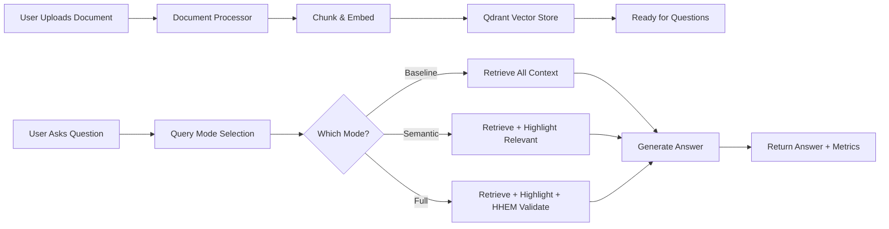
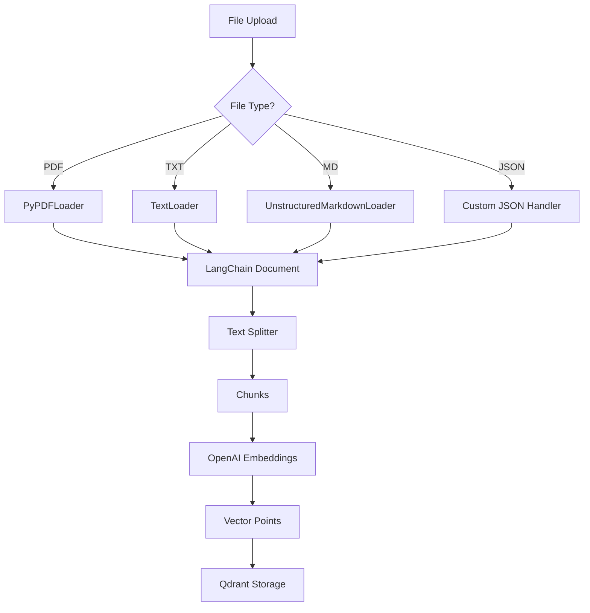
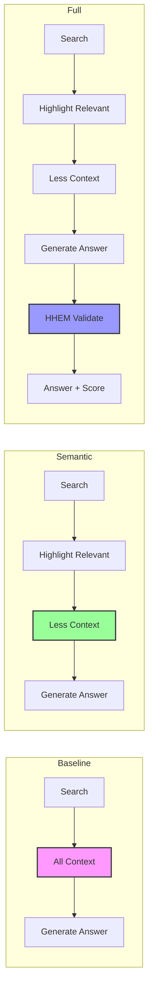
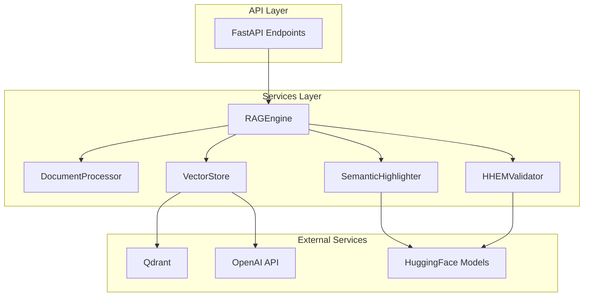
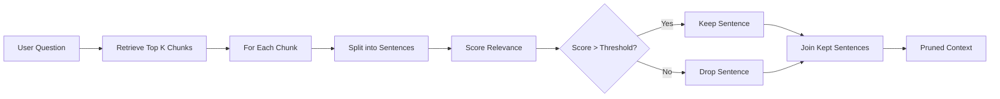
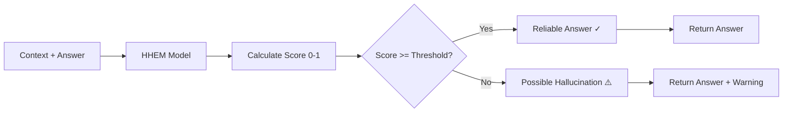
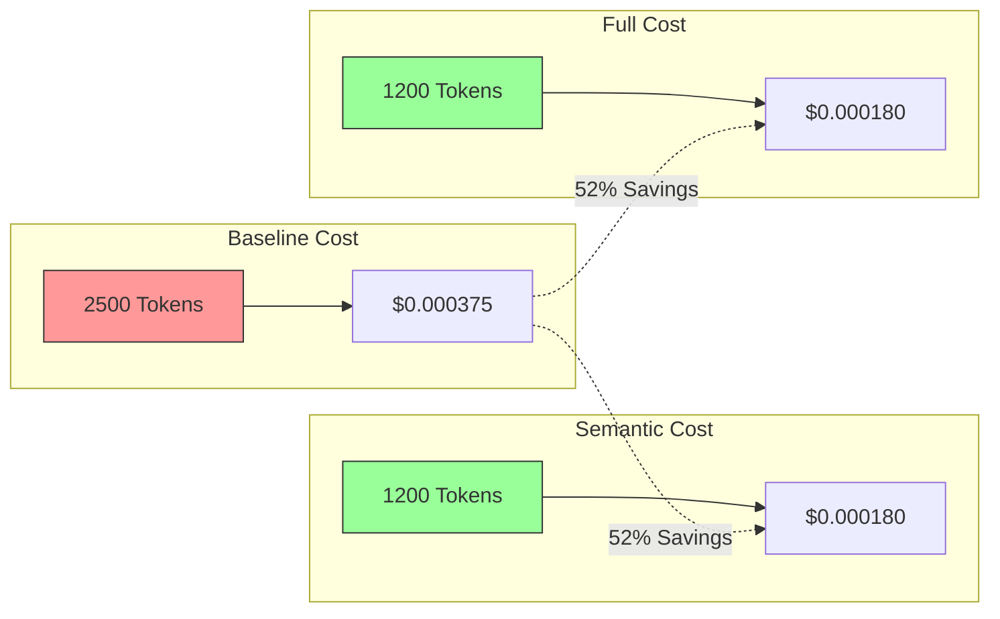

# Architecture Diagrams

## Overall System Flow

## Document Processing Pipeline

## Query Mode Comparison

## Service Layer Architecture

## Semantic Highlighting Process

## HHEM Validation Process

## Cost Comparison

